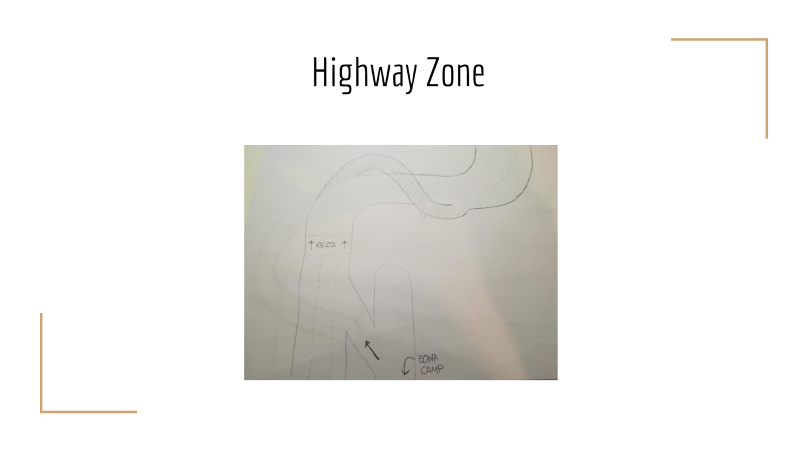
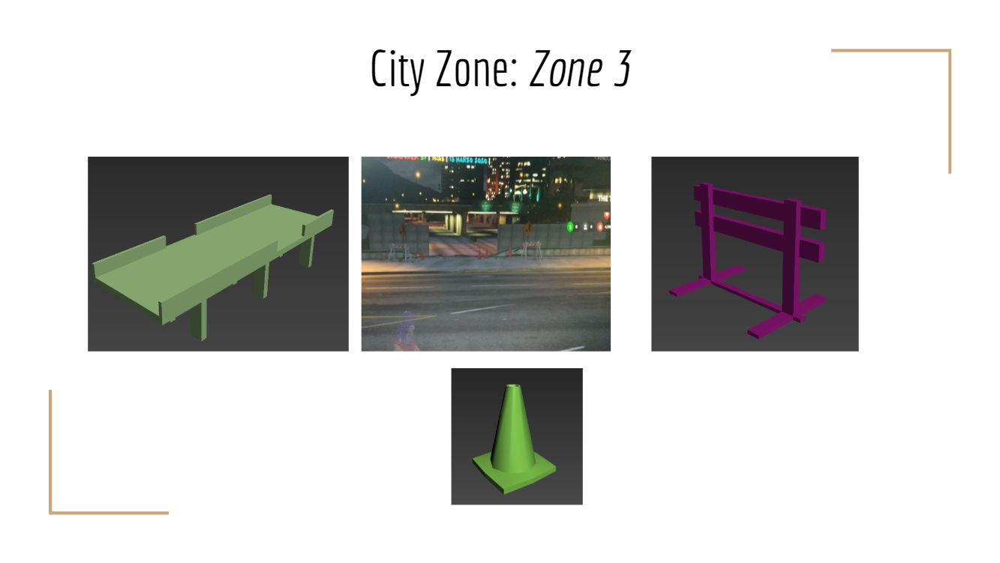

# 3D ENVIRONMENTS

All the classmates have teamed up to create a 3D Environment in Unity.

***

## The Team

### Producers

+ Adrián Mirabel: [Linkedin](https://www.linkedin.com/in/m1r4b3l/) and [GitHub](https://github.com/M1R4B3L)
+ Núria Lamonja: [Linkedin](https://www.linkedin.com/in/n%C3%BAria-lamonja-i-pujol-b149271a2/) and [GitHub](https://github.com/Needlesslord)

### Designers

+ Dani Ruiz: [GitHub](https://github.com/xsiro)
+ Gerard Romeu: [GitHub](https://github.com/Gromeu2000)
+ Tomás Carreras: [GitHub](https://github.com/tomascarreras1000)
+ Albert Robles: [GitHub](https://github.com/Albertito029)
+ Pol Casaú: [Linkedin]( linkedin.com/in/alex-lopez-agudo-9777741a3) and [GitHub](https://github.com/Bullseye14)

**Leads:**

+ Jordi Espriu: [GitHub](https://github.com/LordUnicorn31)
+ Alex Lopez: [Linkedin]( linkedin.com/in/alex-lopez-agudo-9777741a3) and [GitHub](https://github.com/AlexLA99)

### Artists

+ Enric-G. Durán: [GitHub](https://github.com/EnricGDV)
+ Miquel Quintana: [GitHub](https://github.com/Leukino)
+ Òscar Tarrés: [GitHub](https://github.com/oscarta3)

**Leads:**

+ Pau Fiol: [GitHub](https://github.com/paufiol)

### Developers

+ Marc Ariza: [Linkedin](https://www.linkedin.com/in/marc-ariza-0b2b431a2/) and [GitHub](https://github.com/MarcArizaAlborni)

**Leads:**

+ Guillem Turmo: [Linkedin](https://www.linkedin.com/mwlite/in/gturmo) and [GitHub](https://github.com/Turmo11)
+ Aitor Luque: [Linkedin](https://www.linkedin.com/in/aitor-luque-bodet-ab93a4175/) and [GitHub](https://github.com/Aitorlb7)

### QA

+ Marc Gallardo: [Linkedin](https://www.linkedin.com/in/marc-gallardo-3ab9841a4) and [GitHub](https://github.com/Marchusky)

*Note: some of the people involved in the project have decided to not be mentioned on it*

***

## Process

### The Planning

First of all, we had to design each team:

 - 2 producers
 - Designers (2 Leads)
 - Artists (2 Leads)
 - Developers (2 Leads)
 - 3 QA

The resulting groups have been listed above.

Afterwards, the producers had a meeting to discuss how to proceed. They decided the following:

 + They created a Drive account and a GitHut Organization under the name of "Turmo a Terrassa".
 + They developed a calendar and a plan of action
 + They created a WhatsApp group to communicate with the leads
 + Planned a meeting with the leads:
    - They asked to have the tasks of each group to keep track of the progress and the approach of each team, and concept if necessary.
    - They introduced the Drive account and GitHub and how to organize the files
    - The planning and calendar were explained:
      + The planning had the deliveries of each team
      + The calendar was an excel to keep track of what each member had to do, what they did, what time they estimated it would take and the real time it took
    - They also talked about who in the team were the one who would contribute the most and which ones the least (for any given reason)

### Designing the course

 - Leads had a meeting and designed the general concept of the course
 - Team members were handed out each part they had to design
   + Each one had to design one out of the 5 parts and look for references for the art team
 - Leads informed the producers about their course of action

[Here](https://drive.google.com/file/d/1FLgiCL1fQP3awYae3EyWrTy0zvWjyZdt/view?usp=sharing) you can find the Design of the track.

The map has 5 different zones with different themes:

 - General Map

 - City
 

 
 - Under Construction
 
 
 
 - Tracks
 
 
 
 - Countryside
 
 
 
 - Highway

### The Art behind it

 - Following the guidelines of the design team, the art team already had the concept and mood of the track
 - Leads had a meeting to identify the props (which were specified in the GDD) and distribute the work among the members of the team
     + Each one had to build different assets and upload them to the Drive in .obj format

With the references given, these are the props the Art team built:

 - Road
 
 

 - City
 
 
 
 

 - Under Construction
 
 
 
 - Tracks
 
 
 
 - Countryside
 
 
 
 - Highway

 - Others

### How it comes to reality

 - Following the guidelines of the design team, the development team already had the concept and mood of the track
 - The Leads had a meeting to discuss:
     + the tasks of each member
     + how the playability is going to be implemented (looping, winn/lose, etc)
 - Each team member was given a task with a deadline
 - A GitHub was provided were the code will be updated and a release done

[Here](https://github.com/Turmo-A-Terrassa/3DEnvironments/releases) you can see all the releases of the environment.

### QA

 - With the release provided, the QA team tested that the track worked fine and that it was playable whilst challenging
 - A list of improvements was provided
 - Given more time, all the required changes would have been made

***

## Final product

[Here](https://github.com/Turmo-A-Terrassa/3DEnvironments/releases) you can see all the releases of the environment.

***

## What we learned

 - People involved in leadership of the teams and producers did not have enough communication
 - It is difficult to maintain deadlines when there is a lot of time to work
 - Everyone wants to work in their own way, which does not help with communication or the development
 - Each team followed different guidelines to try to adapt to missing information or tasks they thought they were difficult
 - The leaders should have more concrete guidelines (like a format) for they team

### What could be improved in the Design phase

 - One of the parts of the course was not designed and the producers asked the Lead Designers to adapt the map, eliminating that part. This was not done, and there is a part of the course without assets.
 - Producers had the tasks around 3-4 days later than they asked for, and it was difficult to keep track of the process
 - Lead designers adapted their deadlines without asking the producers or warning beforehand; the calendar had to be rearranged. In addition, they weren’t available for most of the time
 - The Leads did not have a base on how to design the track and how to convey their ideas
 - A list of props was not provided
 - The document was not specific enough, without any key buildings or generic assets. For example, localization of the props should have been added
 

### What could be improved in the Art phase

 - Some of the props were either ignored or missing; therefore, the development of the track was delayed. When Leads were asked about this, they denied this fact or ignored the messages and later on, when a developer asked for them, they had to be done. Even like this, some of the props weren’t made
 - Producers had the tasks around 3-4 days later than they asked for, and it was difficult to keep track of the process. They were neither informed about their course of action
 - Lead artists adapted their deadlines without asking the producers or warning beforehand; the calendar had to be rearranged
 - The props should have been all in the same format, either polys or prisms

### What could be improved in the Development phase

 - Leads did not have the base code for when they were expected to. When asked about this, they said they did not understand what they were asked for.
 - Producers had access to the tasks after the development was done.  They were neither informed about their course of action
 - Lead developers started working passed their deadline and adapted their deadlines without asking the producers or warning beforehand; the calendar had to be rearranged

### What could be improved in the Production phase

 - Producers should have been more strict about deadlines
 - Producers should have been more strict about how the deliveries were made, giving a list of requirements to each team (for example, asking the Design Team for a list of props)
 - The producers shouldn’t have been in contact with no-Leads

***

### License

Copyright (c) 2020 CITM Students listed above in the "The Team" section

This environment is licensed under an unmodified MIT license, which is an OSI-certified license that allows static linking with closed source software. Check LICENSE for further details.

Permission is hereby granted, free of charge, to any person obtaining a copy of this software and associated documentation files (the "Software"), to deal in the Software without restriction, including without limitation the rights to use, copy, modify, merge, publish, distribute, sublicense, and/or sell copies of the Software, and to permit persons to whom the Software is furnished to do so, subject to the following conditions:

The above copyright notice and this permission notice shall be included in all copies or substantial portions of the Software.

THE SOFTWARE IS PROVIDED "AS IS", WITHOUT WARRANTY OF ANY KIND, EXPRESS OR IMPLIED, INCLUDING BUT NOT LIMITED TO THE WARRANTIES OF MERCHANTABILITY, FITNESS FOR A PARTICULAR PURPOSE AND NONINFRINGEMENT. IN NO EVENT SHALL THE AUTHORS OR COPYRIGHT HOLDERS BE LIABLE FOR ANY CLAIM, DAMAGES OR OTHER LIABILITY, WHETHER IN AN ACTION OF CONTRACT, TORT OR OTHERWISE, ARISING FROM, OUT OF OR IN CONNECTION WITH THE SOFTWARE OR THE USE OR OTHER DEALINGS IN THE SOFTWARE.

#### Disclaimer
Our projects are non-profit for educational purposes only. We do not intend to earn profit from it, since it is part of a university project taught at CITM-TTC in the degree Videogame Development and Design. All the assets (including sprites, music FX, etc) used which are not developed by us belong to their rightful owners, which will be credited.
